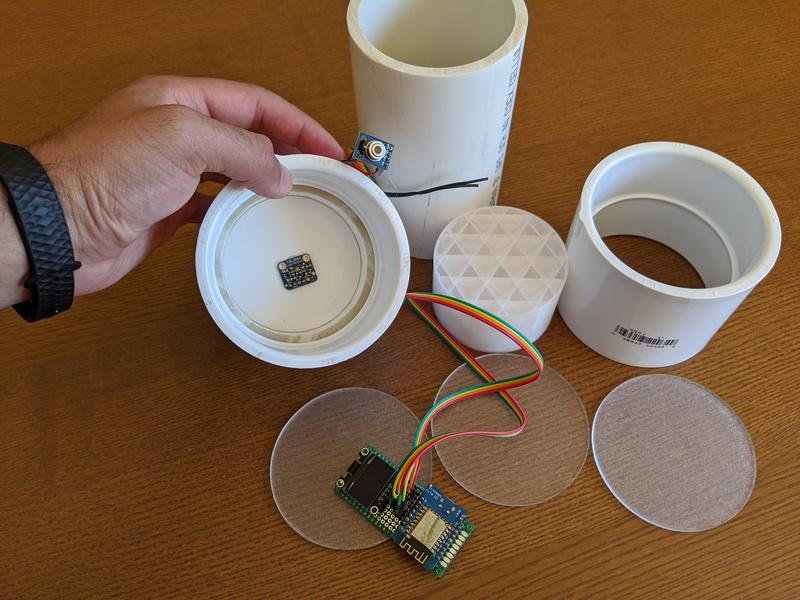
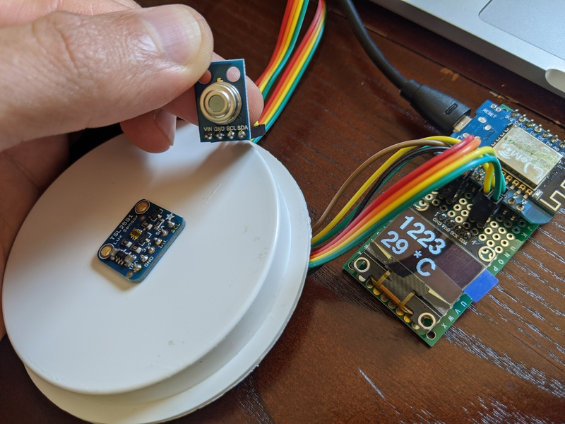
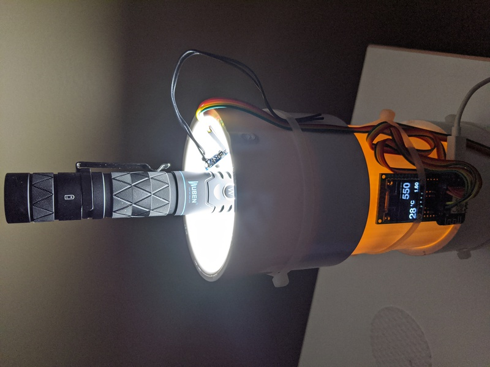

# luxmeter
ESP8266-based WiFi Lux Meter

These aren't full instructions, but should provide a good overview

Equipment needed:
* ESP8266 board (I used a Wemos D1 Mini)
* 0.96" OLED screen, i2c based with SSD1306 controller [such as this](https://www.amazon.com/dp/B06XRBTBTB/)
* TSL2591 Lux sensor [such as this](https://learn.adafruit.com/adafruit-tsl2591)
* MLX90614 IR Temperature sensor [such as this](https://www.amazon.com/gp/product/B07YZVDWWB/)
* Wires and/or perf board

This does not cover the actual construction of the lumen tube.  For mine, I used 3" PVC pipe and fittings, some custom-cut acrylic discs (glass would work well too) covered in D-C Fix diffusion film, and a custom 3D printed (using "clear" PETG) disc of sorts that really scatters the light as is needed for proper integration.  For the 3D printed disc, I just made an appropriately sized cylinder and then when I sliced it in Cura, I used the Cubic infill pattern to create the pattern you see below.

Steps:
* Wire all components in parallel to the i2c pins of the ESP8266 board
* Use Ardunio IDE to load the software on the ESP8266 (don't forget to enter your wifi info)
* Connect the ESP8266 to power.  If all goes right, it should connect to wifi and the sensors and display that information on the screen
* At this point, I like to set a reserved IP address in my router so I always know what IP address I'm using.
* You can now use a web browser to access the lux and temperature values (simply go to the IP address of your ESP8266)
* To log data, use a batch script, such as those attached, to store the readouts into a CSV file.  I run my main script (lux-logger.sh) on a Linux server that I remote into, it sets up the logging process which it sends to the background and continues logging until it's reached the allotted time or lux values fall below the minimum threshhold.  By using 2 scripts (one running in the background), you can disconnect your terminal/ssh session and still have the logging continue.
* Don't forget to calibrate the lux meter (use a get parameter with the calibration factor when accessing the ESP8266's URL)

